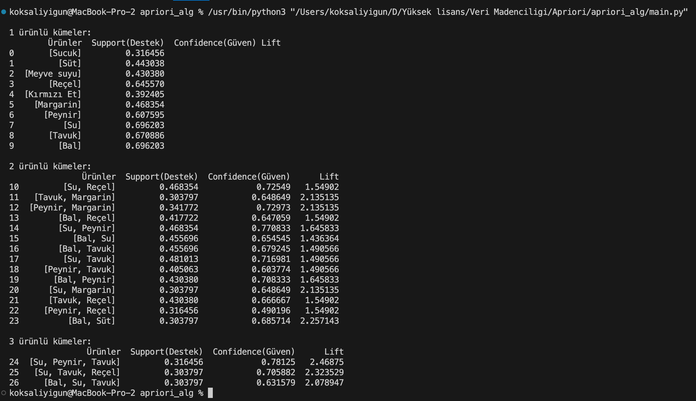

# Apriori Algoritması Uygulaması

Bu proje, Python programlama dilini kullanarak Apriori algoritmasının bir uygulamasını içermektedir. Apriori algoritması, bir veri kümesinde sıkça tekrarlanan öğe kümelerini bulmak için kullanılan popüler bir veri madenciliği algoritmasıdır.

## Proje Açıklaması

Bu projede, hazır bir veri seti üzerinde birlikte satın alınan ürünlerin tespiti için Apriori algoritmasını kullanmaktayız. Proje adımları şu şekildedir:

1. **Apriori Sınıfı ve Yapıcı Metodu**: Ana sınıf olan "Apriori" sınıfı, kullanıcıdan minSupp (minimum destek) ve minGuven (minimum güven) değerlerini parametre olarak alır. Bu değerler, algoritmanın çalışma esasını belirler.

2. **Veri Setinin Okunması ve İşlenmesi**: Veri seti, Python'daki 'csv' kütüphanesi kullanılarak okunur ve işlenir. Satırlar öğelerin bir listesini temsil eder ve bu öğeler, 'set' fonksiyonu ile bir küme haline getirilir.

3. **Destek Değerlerinin Hesaplanması**: Destek değeri, bir öğe kümesinin ne kadar sık bulunduğunu ölçer. Python'da, destek değerleri hesaplanır ve belirlenen minimum destek değeri ile karşılaştırılır.

4. **Güven Değerlerinin Hesaplanması**: Güven değeri, bir öğe kümesinin başka bir öğe kümesine nasıl bağlandığını ölçer. Güven değerleri hesaplanır ve belirlenen minimum güven değeri ile karşılaştırılır.

5. **Öğe Kümelerinin Oluşturulması**: Belirlenen minimum destek ve güven değerlerine sahip öğe kümeleri oluşturulur ve potansiyel ilişkiler keşfedilir.

6. **Sonuçların Yazdırılması ve Değerlendirilmesi**: Algoritmanın çıktıları, kullanıcı dostu bir şekilde yazdırılır ve analiz edilir.

## Nasıl Kullanılır

1. `main.py` dosyasını çalıştırın.
2. Ana sınıf olan "Apriori" sınıfının yapıcı metoduna minSupp ve minGuven değerlerini verin.
3. Veri seti dosyasının yolunu belirleyin ve gerekirse diğer parametreleri ayarlayın.
4. Program çıktısında, birlikte satın alınan ürünlerin tespit edildiği sonuçları göreceksiniz.

## Gereksinimler

- Python 3.x
- pandas kütüphanesi

## Lisans

Bu proje MIT Lisansı altında lisans

